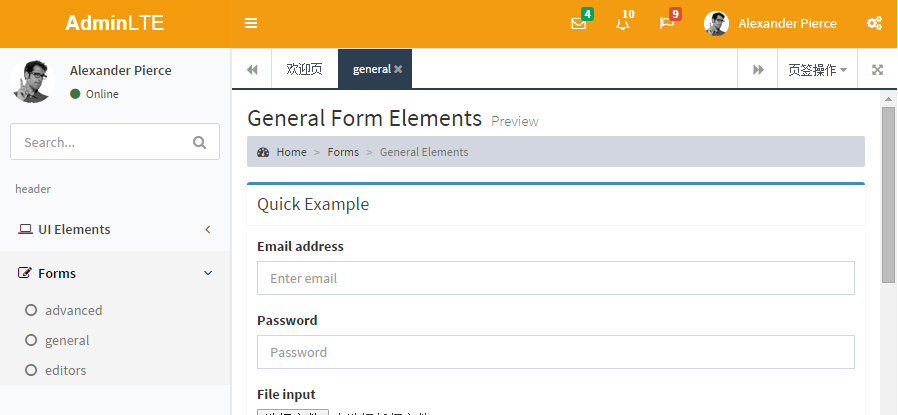
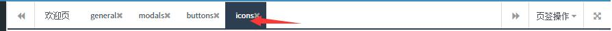

Introduction(简介)
================

**AdminLTE with iframe** -- Based on **AdminLTE** framework. It integrated with iframes with is popular in china admin systems.

(基于AdminLTE框架,并且集成了iframe的tab页面,是一款适合中国国情的后台主题UI框架)

**Preview on github: [https://weituotian.github.io/AdminLTE-With-Iframe/pages/index_iframe.html](https://weituotian.github.io/AdminLTE-With-Iframe/pages/index_iframe.html)**

**Preview on oschina: [http://weituotian.oschina.io/adminlte-with-iframe/pages/index_iframe.html](http://weituotian.oschina.io/adminlte-with-iframe/pages/index_iframe.html)**





branch(分支)
----------
更新分支为iframe

reference(参考)
-------------
**[super ui](https://github.com/tzhsweet/superui)**

(iframe功能的js和页面css都是参考superui得出来的)

Installation(安装)
----------------
修改可以使用grunt构建工具

- 安装nodejs
- 根目录下命令行执行
- npm install

Documentation(文档)
-----------------
may be you should **customize** the system by reading the codes!
(请阅读源码进行修改)

[AdminLTE官方文档](http://weituotian.oschina.io/adminlte-with-iframe/documentation/index.html)

### iframe框架

介绍一些集成了iframe后新增的功能，和修改方法。
请确认执行完上面文档的安装部分。
可随时开启issue.

#### 选项卡右键菜单，双击刷新


* 修改右键菜单的文字，请参阅 [bootstrap-tab.js](build/js/iframe/bootstrap-tab.js) ，内有`context.attach`初始化json菜单，并且可以参考其获取特定tab当前url的代码
* 刷新选项卡刷新当前tab页，bootstrap-tab.js中的`$tabs.on("dblclick",`绑定了双击事件。可注释取消这个功能

####　一些配置

在 [index_iframe.html](pages/index_iframe.html) 中：

```
//设置根目录，
//比如本演示中的地址是http://weituotian.oschina.io/adminlte-with-iframe/pages/index_iframe.html#
//上一级就是http://weituotian.oschina.io/adminlte-with-iframe/pages
//当前实际的开发中一般用不到
//比如你的首页用到index_iframe.html这个模版，访问地址为http://localhost/，就不用设置了
//如果你部署在http://localhost/xxx, xxx是你部署的路径，那么就按以下代码设置一下根目录
App.setbasePath("../");

//设置图片路径，相对于根目录
//这个框架带有一些图片（加载进度条等），你可以放置在其它地方
//但要如下设置，
//比如在本项目中，引用的图片放在了根目录下，dist/img/中
App.setGlobalImgPath("dist/img/");

```

####　左侧菜单生成

如下操作，可参考 index_iframe.html, [sidebarMenu.js](build/js/iframe/sidebarMenu.js)
```
        var menus = [
            {
                id: "9000",
                text: "header",
                icon: "",
                isHeader: true
            },
            {
                id: "9002",
                text: "Forms",
                icon: "fa fa-edit",
                children: [
                    {
                        id: "90021",
                        text: "advanced",
                        url: "forms/advanced_iframe.html",
                        targetType: "iframe-tab",
                        icon: "fa fa-circle-o"
                    },
                    {
                        id: "90022",
                        text: "general",
                        url: "forms/general_iframe.html",
                        targetType: "iframe-tab",
                        icon: "fa fa-circle-o"
                    }
                ]
            }
        ];
        $('.sidebar-menu').sidebarMenu({data: menus});
```


#### tab的操作

##### 增加新tab
动态增加菜单，你可以从后台读取菜单，用以下的json格式封装。同时还可以自己额外增加菜单
```
//欢迎页的菜单。
        addTabs({
            id: '10008',
            title: '欢迎页',
            close: false,
            url: 'welcome_iframe.html',
            urlType: "relative"
        });
```

- **id** 代表这个tab的id，重复id将认为同一个tab，如果你从数据库读取菜单，那么可以设置该id为数据库中菜单的id
- **title** 选项卡的标题
- **close**　false表示不可以关闭
- **url** 指定一个url地址，绝对或者相对
- **urlType** 可选relative和absolute ,默认是relative, 相对于当前页面（管理所有tab的页面）
比如`http://localhost/index.html`,想打开index.html同级目录UI下的页面，就给`url:UI/welcome.html;urlType:relative`

##### 获得当前激活的tab的id
```
var pageId = getActivePageId();
```
最长用吧，一般这个就够了

##### 获得当前激活的tab的id
```
var pageId = getPageId(element);
```

element一般是tab栏的a超链接元素，jq对象和普通的dom都可以

##### 根据pageId获得当前选项卡的标题
```
var title = findTabTitle(pageId);
```


##### 根据pageId获得当前iframe

```
var $iframe = findIframeById(pageId);
```  
这个iframe是一个jq对象

##### 根据pageId获得当前panel

```
var $panel=findTabPanel(pageId)
```  
这个panel是一个div，装有iframe，jq对象

##### 关闭当前tab

```
closeTabByPageId(pageId);
```  
pageId是你创建tab时候的id

Browser Support(浏览器支持)
----------------------
- IE 9+
- Firefox (latest)
- Chrome (latest)
- Safari (latest)
- Opera (latest)

##### 未完待续

License
-------
AdminLTE is an open source project by [Almsaeed Studio](https://almsaeedstudio.com) that is licensed under [MIT](http://opensource.org/licenses/MIT). Almsaeed Studio

reserves the right to change the license of future releases.

(开源免费)

Todo List
---------
- jquery pace integration
